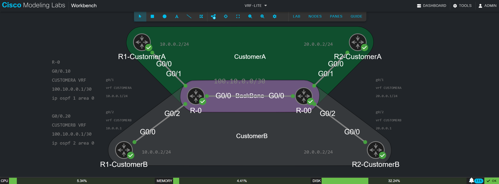

# VRF-LITE
Working on a small lab to practive VRF-LITE
I took come time to practivce VRF-LITE between 2 customers with 2 different sites. 
I used CML, and I will try to have the topology file uploaded into the files here for you to practice. 
